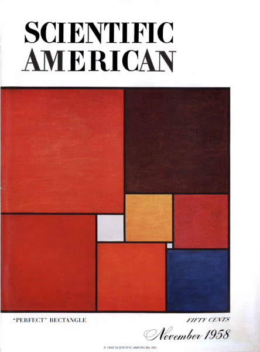
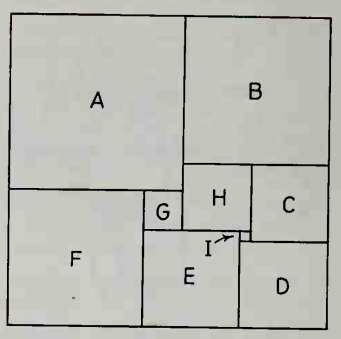

# Perfect Rectangles

Βλέποντας κανείς το iconic εξώφυλλο του περιοδικού [Scientific American - Νοέμβριος 1958](https://www.scientificamerican.com/issue/sa/1958/11-01/) το πρώτο που μπορεί να σκεφτεί είναι ότι πρόκειται για έναν πίνακα του [Piet Mondrian](https://en.wikipedia.org/wiki/Piet_Mondrian) ή Mondriaan αν τον γνωρίζατε πριν το 1912, όπου κατά τη μετακόμιση από τις Κάτω Χώρες για το Παρίσι χάθηκε ένα `a` από το επίθετό του.

Το σχήμα αυτό υπάρχει και σε μία άσκηση στο βιβλίο [Geometry: Seeing, Doing, Understanding](https://books.google.gr/books?id=deFYvgAACAAJ) του Harold R. Jacobs. Ο αναγνώστης καλείται να βρει το μέγεθος όλων των τετραγώνων, αν γνωρίζει ότι η επιφάνεια των `C` και `D` είναι 64 και 81 αντίστοιχα.

Τελικά το σχήμα στο εξώφυλλο είναι ένα *Τέλειο Ορθογώνιο Παραλληλόγραμμο* (*Perfect Rectange*) και όχι κάποιος διάσημος πίνακας. [Τέλειο Ορθογώνιο Παραλληλόγραμμο](https://en.wikipedia.org/wiki/Perfect_rectangle) είναι ένα ορθογώνιο παραλληλόγραμμο το οποίο μπορεί να χωριστεί τετράγωνα διαφορετικού μεγέθους. Στην στήλη [Mathematical Games](mathematical_games.pdf) αυτού του τεύχους, σελ. 138 υπάρχει μία πολύ όμορφη παρουσίαση των *Perfect Rectangles* και αναφορά στο άρθρο "The dissection of rectangles into squares"[^1] στο οποίο γίνεται και η συσχέτιση με τα ηλεκτρικά κυκλώματα!

Χρησιμοποιώντας ξύλο και χρώματα Θα φτιάξουμε ένα παζλ το οποίο θα έχει 2 βαθμούς δυσκολίας. Από τη μία πλευρά θα βάψουμε τα κομμάτια με το ίδιο χρώμα. Αυτό θα είναι το δύσκολο mode. Από την άλλη πλευρά, θα βάψουμε τα κομμάτια με 4 διαφορετικά χρώματα. Γιατί 4; Μα επειδή γνωρίζουμε από το [Θεώρημα των τεσσάρων χρωμάτων](https://en.wikipedia.org/wiki/Four_color_theorem) ότι τόσα είναι τα ελάχιστα χρώματα με τα οποία μπορούμε να βαψουμε τις περιοχές ενός χάρτη χωρίς δύο γειτονικές περιοχές να έχουν το ίδιο χρώμα! Με αυτόν τον τρόπο μπορούμε να βοηθήσουμε τον παίχτη να αποκλείσει διπλανά κομμάτια.

## References

[^1]: R. L. Brooks. C. A. B. Smith. A. H. Stone. W. T. Tutte. "The dissection of rectangles into squares." Duke Math. J. 7 (1) 312 - 340, 1940. https://doi.org/10.1215/S0012-7094-40-00718-9

see these references:

- https://dialectrix.com/G4G/SquaringTheSquare.html